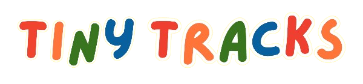

<div align="center" markdown="1">
  

**A Gross Motor Skills Assessment System using SOTA Deep Learning model**

</div>

## Project Description

The problems of traditional manual assessment methods for motor skills assessment include the limited qualified professionals, and potential subjectivity of the assessment. This project aimed to design an activity recognition model that utilizes deep learning for a system that assesses the gross locomotor skills in children. To achieve the results, different deep learning algorithms were trained and evaluated. The skeleton-based action recognition model was utilized to recognize locomotor activities based on a collection of video recordings of children performing the activities from the Test of Gross Motor Development 2nd Edition (TGMD-2). The deep learning model is able to recognize gross motor activities from videos, providing an automated and in-depth assessment of motor skills based on the TGMD-2. The system’s ability to track locomotor activities and assess motor skills suggests the project’s potential solution from existing problems and holds as a complementary tool for pediatric motor skills assessment.

```
@citation{
title:      Design of Deep Learning-Based Gross Locomotor Activity
            Recognition for Pediatric Motor Skills Assessment System

author/s:   Del Rosario, Christian Ainsley, Gayla, Harry, Lacsamana, Allyssa,
            Nepomuceno, Cyrus Snake

year:       2024
}
```

## Environment Setup

For client-side:

1. Run `npm install` in terminal to install packages listed from package.json.
2. Run `npm run dev` to run the client server using Vite.

For server-side:

1. Create virtual environment (.venv) by running the command in terminal: `python -m venv .venv`.
2. Activate virtual environment by accessing `".venv/Scripts/activate.bat"` in cmd.
   <br>**Note:** `(.venv){project_dir}` will be visible once activated.
3. Run `pip install -r requirements.txt` in terminal to install required modules.
4. Enter command `python manage.py migrate` to propagate changes in models.
5. Run command `python manage.py runserver` to run server in localhost. <br>

**[If necessary]** Install custom packages by running the command `python setup.py install` in terminal.

For TDD - Test-Driven Development:

1. Run `npm test` in terminal for client unit testings.
2. Run `pytest` in terminal for server unit testings. (`pytest -s` to stdout `print()` statements).

## Committing Guidelines

For a cleaner and much better readability of commit messages, please consider following the considered guidelines:

-   **[feat]**: Use this for new features implemented.
-   **[fix]**: Use this tag for bug fixes-related changes.
-   **[routes]**: Use this for new routes created.
-   **[ui]**: Use this tag for new UI components, styles, or any UI-related changes.
-   **[improvement]**: Use this for non-bug fixes that improve the application.
-   **[chore]**: Use this for commits that do not directly affect functionality.
-   **[docs]**: Use this for changes in documentation.
-   **[test]**: Use this for adding tests.
-   **[dependency]**: Use this for changes in dependencies.
-   **[merge]**: Use this for merge conflicts.
-   **[refactor]**: Use this for core restructing that improves readability or maintability without changing functionalities.
